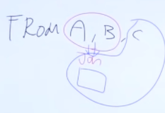

[메인으로 이동](../README.md)

# 📒 SQLD 최종 정리 1편

- 김강민 SQLD 강사 최종 정리강의 영상 정리 + 내용 추가 (개념, 기출 등)
    - 강의 영상 기준으로 정리한 뒤에 내용 추가 중
        - 영상에 중요하다고 언급만 하고 설명하지 않은 내용
        - 관련 기출
        - 그 밖에 중요한 것 같은 내용 
- sqld 목차 거의 다 훑음.
- 참고
    - 김강민 강사 영상
        - 1편: [https://youtu.be/PC3ypt_VGWI](https://youtu.be/PC3ypt_VGWI)
        - 2편: [https://youtu.be/PjCSvexo3Ow](https://youtu.be/PjCSvexo3Ow)
    

## 목차 <a id="aid-index">

[📒 2편](./최종정리%202편.md)

### 📒 1편

1. [SQL 명령문 개괄](#aid-1)
1. [SELECT](#aid-2)
1. [논리연산자](#aid-3)
1. [SQL 연산자](#aid-4)
1. [⭐ NULL](#aid-5)
1. [ORDER BY](#aid-6)
1. [함수](#aid-6_1)
1. [숫자 함수](#aid-7)
1. [문자열 함수](#aid-8)
1. [날짜함수](#aid-9)
1. [DECODE / CASE](#aid-10)
1. [⭐ 집계함수](#aid-11)
1. [GROUP BY](#aid-12)
1. [JOIN](#aid-13)
1. [서브쿼리](#aid-14)
1. [집합연산자, 순수관계연산자](#aid-15)
1. [DDL](#aid-16)
1. [DML](#aid-17)
1. [⭐ 제약조건](#aid-18)
1. [DCL](#aid-19)
1. [VIEW](#aid-20)
1. [⭐ 그룹함수](#aid-21)
1. [TCL](#aid-22)

## 1편

### 🔷 SQL 명령문 개괄 <a id="aid-1">

[목차로 이동](#aid-index)

1. SELECT 문장 논리적 실행 순서 (기출 42회)
    - from - where - group by - having - SELECT - order by 
        - 노랭이 72p 과목2 - 59번

1. 종류알기 (기출 42회)
    - DML - SELECT, INSERT, DELETE, UPDATE, MERGE, call, explain plan, lock table
    - DDL - alter, create, modify, drop, truncate, rename, comment
    - TCL - rollback, commit, savepoint, set transaction
    - DCL - grant, revoke

1. order by
    - SELECT에 선택되지 않은 칼럼도 사용 가능
    - alias 명이나 칼럼 순서 나타내는 정수 사용 가능
    - 오라클에서는 NULL을 가장 큰 값, SQL Server에서는 NULL을 가장 작은 값
    - 데이터형이 varchar인지 number인지 유의 (기출 42회)
        - number: 1 < 2 < 10
        - varchar: '1' < '10' < '2'

### 🔷 SELECT <a id="aid-2">

[목차로 이동](#aid-index)

1. distinct (집약)
    - distinct deptno, mgr
        - 괄호가 생략되어있는 거다. 즉, distinct (deptno, mgr)
2. as
    - SELECT에 쓰는 경우
        1. as 생략 가능
        2. 컬럼명에 띄어쓰기 있는 경우 
            - "직원 번호"
    - from에 쓰는 경우
        - 사용불가
3. concat
    - +: SQL server
    - ||: oracle
    - concat 연산자 무조건 인수가 2개이다.

### 🔷 논리연산자 <a id="aid-3">

[목차로 이동](#aid-index)

1. and, or, not
2. ⭐ 연산순위
    1. NOT
    2. AND
    3. OR

### 🔷 SQL 연산자 <a id="aid-4">

[목차로 이동](#aid-index)

1. A between 1 and 2
    - 1≤A≤2
2. A in (1, 2, 3)
    - A=1 or A=2  or A=3
3. ⭐ LIKE
    1. _: 미지의 한 글자
    2. %: 0이상 글자
    3. escape: 와일드카드( _ , %)를 문자로 취급
        - ename like 'A@_A' escape '@'
            - @가 아닌 다른 문자가 될 수도 있다.
4. rownum과 top
    1. rownum (oracle)
        - where 쓴다면 조건에 rownum=1이 포함되어야 한다.
            - `SELECT e.*, rownum from emp e where rownum >=2 order by sal desc;`
                - 결과 안나온다.
        - SELECT empno, sal from emp where rownum <= 3 order by sal desc
            - 정렬 전을 기준으로 rownum이 실행된다는 점 유의
            - order by가 가장 마지막에 실행된다.
            - `SELECT * from emp e order by sal desc;`
                
                
                
        - `SELECT e.*, rownum from emp e where rownum <=3 order by sal desc;`
            
            
            
    2. top (SQL server)
        - (SELECT) top (n) (컬럼명)
            - 상위 n개행 가져온다.

### 🔷 SQL 연산자 <a id="aid-4">

### 🔷 ⭐ NULL <a id="aid-5">

[목차로 이동](#aid-index)

1. null의 정의
    - 부재, 모르는 값
    - 산술연산: null + 2, null - 4, null * null
        - null
    - 비교연산: null = null, null = 2
        - 알수없음(unknown)
        - where 조건 안에 들어가면 False
    - 정렬 상 의미 
        - oracle: 무한대 (`ORDER BY` 할 때 제일 큰 값)
        - SQL server: -무한대 (`ORDER BY` 할 때 제일 작은 값)

1. 빈값과 공백
    - 오라클에서 빈값은 null이다. (SQL Server에서는 빈값자체로 저장되고 null이 아니다.)
        - `insert into tb_null values ('b', '');` 에서 두번째 컬럼의 값은 null이 된다.
    - 공백은 null이 아니다.
        - `insert into tb_null values ('f', ' ');` 에서 두번째 컬럼의 값은 공백 한칸이다.

1. WHERE 절에서 조건
    - `IS NULL`를 사용해야 한다. (등호가 아닌) 
    - WHERE COL2 IS NULL과 같이 써야 COL2가 NULL인 것을 찾는다.
    - WHERE COL2 = NULL로 쓰면 찾지못한다.
    - 예시
        - `select count(col1) from tb_null where col2 = null;` 은 무조건 0이 나온다.
        - `select count(col1) from tb_null where col2 is null;` 로 써야 제대로 찾는다.

1. 함수
    - nvl(값1, 값2)
        - 값1이 null이라면 값2, 아니면 값1
    - nvl2(값1, 값2, 값3)
        - 값1이 null이라면 값3, 아니면 값2
    - isNull(값1, 값2)
        - nvl과 동일
    - nullif(값1, 값2)
        - 두 값이 같으면 null, 다르면 값1
    - coalesce(값1, 값2, ...)
        - 값1부터 봤을 때 널 아닌 첫번째 값

1. 문제
    - 노랭이 62p 44 ~ 50 
    - `SELECT COALESCE(NULLIF('A', 'A'), 'B') FROM DUAL;` 의 결과: B

### 🔷 ORDER BY <a id="aid-6">

[목차로 이동](#aid-index)

1. 정렬의 특성
    - 가장 마지막 실행
    - 성능이 느려질 수 있다.
    - null 값과의 관계(오라클에서는 무한대, SQL Server에서는 -무한대)

1. 컬럼 번호 정렬
    - 출력되는 컬럼의 수보다 큰 값 불허

1. 인수 두개 정렬
    - sal desc, ename asc
        - sal이 값으면 ename 오름차순

1. 출력 컬럼 아닌 컬럼으로 정렬 가능
    - `SELECT ename ..... order by sal`: 가능

1. TOP(N)
    - SQL Server 문법. 상위 N명 출력
    - WITH TIES
        - 상위 마지막 순서에 여러명일 경우 모두 출력
        - `SELECT TOP(3) WITH TIES 팀명, 승리건수 FROM 팀별성적 ORDER BY 승리건수 DESC;`
            - 상위 3명 출력하는 데 마지막 순위에 동점자있으면 모두 출력

### 🔷 함수 <a id="aid-6_1">

[목차로 이동](#aid-index)

1. 함수 분류
    1. 내장 함수(Built-in Function): 벤더에서 제공하는 함수
        1. 단일행 함수
        1. 다중행 함수
            1. 집계 함수
            1. 그룹 함수
            1. 윈도우 함수
    1. User Defined Function: 사용자가 정의할 수 있는 함수

1. 내장 함수
    - 함수의 입력 행수에 따라 단일행 함수와 다중행 함수로 구분할 수 있다.
    - 단일행 함수는 SELECT, WHERE, ORDER BY, UPDATE의 SET 절에 사용이 가능하다.
    - 1:M 조인이라 하더라도 단일행 함수를 사용할 수 있다. (M쪽에서 출력된 행을 하나씩 단일행 함수의 입력값으로 사용)
    - 다중행 함수도 단일행 함수와 동일하게 단일 값만을 반환한다.

### 🔷 숫자 함수 <a id="aid-7">

[목차로 이동](#aid-index)

1. round 자릿수
    - round(123.54) = 124
    - round(123.54, 0) = 124
    - round(123.54, 1) = 123.5
1. ceil(oracle) / ceiling(SQL Server)
    - 올림
1. trunc(oracle) / floor(SQL Server, oracle)
    - 내림

1. 음수 관련
    - `SELECT CEIL(-3.8), FLOOR(-3.8), ROUND(-3.8) FROM DUAL;`
        - -3, -4, -4
    - `SELECT CEIL(3.8), FLOOR(3.8), ROUND(3.8) FROM DUAL;`
        - 4, 3, 4

1. 기출
    1. 42회
        FLOOR 함수 값 구하기
    1. 30회
        `SELECT ABS(-3.8), FLOOR(3.8), TRUNC(3.8), ROUND(3.8) FROM DUAL`에 대한 값을 구하시오.
            - 3.8, 3, 3, 4

### 🔷 문자열 함수 <a id="aid-8">

[목차로 이동](#aid-index)

1. upper, lower
2. lpad, rpad, ltrim, rtrim
3. substr, instr
    - 실습해보기

### 🔷 날짜함수 <a id="aid-9">

[목차로 이동](#aid-index)

1. to_char, to_date
    - 실습해보기
    - 형변환함수
2. sysdate(oracle), getdate() (SQL Server)
3. 날짜데이터 + 100
    - 100일 이후

### 🔷 DECODE / CASE <a id="aid-10">

[목차로 이동](#aid-index)

1. CASE와 DECODE 개념
    - [https://smoh.tistory.com/294](https://smoh.tistory.com/294)

1. 주로 CASE만 나온다.
    - CASE WHEN ~~ THEN ~~ WHEN ~~ THEN ~~  ELSE ~~ END
    - ELSE가 없을 때 앞의 조건들 모두 만족하지 않으면 null 출력
    - DECODE는 실습만 한번 해보기

1. CASE의 2가지 표현법 (노랭이 2과목 43번)
    - SEARCHED_CASE_EXPRESSION
        - `CASE WHEN LOC = 'NEW YORK' THEN 'EAST' ... `
    - SIMPLE_CASE_EXPRESSION
        - `CASE LOC WHEN 'NEW YORK' THEN 'EAST' ... `

### 🔷 ⭐ 집계함수 <a id="aid-11">

[목차로 이동](#aid-index)

1. null 과의 관계 (기출 42회)
    - SUM(A)에서 각각의 레코드 중  A 컬럼의 값 null은 0 취급
    - SUM(A+B)에서 각각의 레코드 중 A 컬럼의 값 + B 컬럼의 값을 했을 때  null 값이면 해당 값은 0 취급
    
    - 예시
        |A|B|C|
        |---|---|---|
        |null|null|1|
        |3|2|2|
        |null|2|3|

        - SELECT한 3개의 레코드에 대해 A컬럼에 값이 null, 3, null이고 B컬럼에 값이 null, 2, 2라할 때
            - SUM(A) = 3, SUM(B) = 4, count(A) = 1, count(*) = 3
        - SUM(A+B+C) (35회기출)
            - 7
            - 첫번째 레코드 A+B+C = null + null + 1 = null
            - 두번째 레코드 A+B+C = 3 + 2 + 2 = 7
            - 세번째 레코드 A+B+C = null + 2 + 3 = null

        - SUM(A) + SUM(B) + SUM(C) = 3 + 4 + 6 = 13

        - AVG(A) = 3, AVG(B) = 2, AVG(C) = 2
    

### 🔷 GROUP BY <a id="aid-12">

[목차로 이동](#aid-index)

1. 집약기능
2. 그룹수준으로 정보를 바꾼다.

### 🔷 JOIN <a id="aid-13">

[목차로 이동](#aid-index)

1. natural join, using
    - 중복된 컬럼 하나로
        - 제일 앞에 등장
    - ⭐ using에서 alias 사용 x (natural join은 사용 가능)
1. left outer join, A left outer join B (기출 42회)
    - = A col1 = B col1(+)
    - 기출 42회: 빈칸에 LEFT OUTER JOIN 넣는 문제

1. 조인
    - 일반적으로 JOIN은 PK와 FK 값의 연관성에 의해 성립된다.
        - 어떤 경우에는 이러한 PK, FK의 관계가 없어도 논리적인 값들의 연관만으로 JOIN이 성립 가능하다.  
    - DBMS 옵티마이저는 FROM 절에 나열된 테이블이 아무리 많아도 항상 2개의 테이블씩 짝을 지어 JOIN을 수행한다.
        - 조인순서 

            

            - A랑 B 조인하고 그 조인한 걸 C와 조인
    - EQUI JOIN은 JOIN에 관여하는 테이블 간의 칼럼
    - EQUI JOIN은 '=' 연산자에 의해서만 수행되며, 그 이외의 비교 연산자를 사용하는 경우에는 모두 NON EQUI JOIN 이다.
    - 대부분 NON EQUI JOIN을 수행할 수 있지만, 때로는 설계상의 이유로 수행이 불가능한 경우도 있다.

1. 문제
    1. 카디션 곱을 생성하는 JOIN은?
        - CROSS JOIN

### 🔷 서브쿼리 <a id="aid-14">

[목차로 이동](#aid-index)

1. 서브쿼리 들어가는 경우
    - SELECT: scalar
    - from: inline view (메인쿼리의 컬럼 사용 가능)
    - where: 거의 모든 서브쿼리 다 들어간다. (중첩서브쿼리)
    - group by: X
    - having: 거의 모든 서브쿼리 (중첩서브쿼리)
    - order by: scalar
2. SELECT from A where (SELECT from B where a.col = b.col)
    
    
    
    - A테이블에서 하나의 레코드마다 B 테이블을 다 돌려본다.
        - 이 때 A의 col 값은 고정되어 있다.
3. in, any/some, all, exist
    - 기능 알기

### 🔷 집합연산자, 순수관계연산자 <a id="aid-15">

[목차로 이동](#aid-index)

1. 집합연산자 (기출 42회)
    - union, intersect, minus (SQL Server에서는 except)
        - 정렬작업 O, 느리다
    - union all
        - 중복데이터 O, 정렬작업 x, 빠르다

1. 기출 
    1. 42회
        - 교집합 그림 주고 연산자 고르는 문제

### 🔷 DDL <a id="aid-16">

[목차로 이동](#aid-index)

1. TCL과 연관지어 생각하기

1. 비교
    - truncate vs drop
        - 구조는 남음 vs 구조도 삭제
    - truncate vs DELETE
        - DDL vs DML
        - 디스크 사용량 초기화 vs 디스크 사용량 초기화 X
            - 최초 테이블 생성시 할당된 Strorage만 남기고 Release vs 데이터는 Delete되도 Storage Release 안함
        - 롤백불가능 vs 롤백가능

1. 문제
    1. SUMMBER 테이블 이름을 FALL로 변경하는 쿼리
        - `RENAME SUMMER TO FALL;`

    1. 다양한 권한을 그룹으로 묶어 관리할 수 있는 것
        - ROLE

### 🔷 DML <a id="aid-17">

[목차로 이동](#aid-index)

1. 요즘 안나오는 추세
1. INSERT, UPDATE, DELETE
    - TCL(commit, rollback)과 연관지어 나온다.
1. MERGE INTO
    - 신유형(기출 37회). MERGE INTO에 대해 한번 보면 좋다.
    - [MERGE INTO 설명](https://gent.tistory.com/406)
    - MERGE INTO tb_a USING tb_b ON (조건) ~
        - `tb_b`의 각 행에 대해서 `조건`을 만족하는 `tb_a`의 행이 
            - 존재한다면
                - WHEN MATCHED THEN에 있는 구문 실행 (x or UPDATE or DELETE or 둘다)
            - 존재하지 않는다면
                - WHEN NOT MATCHED THEN에 있는 구문 실행 (x or INSERT)
    - INSERT와 UPDATE 한번에 할 수 있다.
    - 조건을 만족하는 행이 존재하는 경우 UPDATE만 하는 것이 아닌 DELETE도 같이 할 수도 있다.

1. 문제

    1. 기출 37회 14번 (MERGE INTO)

        
    
        - [기출 37회 14번 문제 및 해설(sqlpd 카페)](https://cafe.naver.com/sqlpd/20824)

### 🔷 ⭐ 제약조건 <a id="aid-18">

[목차로 이동](#aid-index)

1. PK(=unique + not null), unique, not null 

### 🔷 DCL <a id="aid-19">

[목차로 이동](#aid-index)

1. grant, revoke
    - 정의
    - role의 특징 (명령어가 아닌 객체[object]이다.)
    - 문법 (on to 구문)
        - grant SELECT on B to A (A계정에게 B테이블의 seslect 권한 주기)

### 🔷 VIEW <a id="aid-20">

[목차로 이동](#aid-index)

1. VIEW의 특징
    - 독립성
    - 편리성
    - 보안성
2. 테이블이 아닌 sql 명령문을 저장하는 것으로 용량 필요하지만 테이블보다는 덜 차지

### 🔷 ⭐ 그룹함수 <a id="aid-21">

[목차로 이동](#aid-index)

1. 그룹함수

    - [그룹함수 쉬운 예제로 이해하기(velog.io/@dongchyeon/)](https://velog.io/@dongchyeon/%EC%98%A4%EB%9D%BC%ED%81%B4Oracle-%EA%B7%B8%EB%A3%B9-%ED%95%A8%EC%88%98-ROLLUP-CUBE-GROUPING-%EB%93%B1)

    - 그룹함수 3가지: ROLLUP, CUBE, GROUPING SETS
        - ROLLUP (A, B)와 ROLLUP (B, A)는 다르다.
        - CUBE (A, B)와 CUBE (B, A)는 같다.
        - 빈칸 뚫어놓고 어떤 함수인지 찾을 때
            1. null 다찾기
            2. 총합 행 찾기
                1. 총합 행 있으면 ROLLUP, CUBE
                    1. 양쪽으로 결과가 나오면 CUBE, 한쪽만 계층으로 나오면 roll up
                2. 총합 행 없으면 GROUPING SETS SETS
    - grouping
        - 요즘 잘 안나온다.

### 🔷 TCL <a id="aid-22">

[목차로 이동](#aid-index)

1. commit, rollback

1. 묵시적 커밋과 명시적 커밋
    - 묵시적 커밋
        - Oracle의 경우 DDL문이 실행되었을 때 내부적으로 커밋 발생한다.
            - AUTO COMMIT이 FALSE이더라도 커밋 발생한다.
        - SQL Server의 경우 DDL문이 실행되더라도 커밋이 묵시적으로 발생하지 않는다.
    - AUTO COMMIT 설정
        - 오라클
            - 기본적으로 FALSE이다.
            - TRUE: DML 후 자동 커밋
            - FALSE이더라도 DDL은 무조건 자동 커밋 (묵시적 커밋)
        - SQL Server
            - 기본적으로 TRUE이다.
            - FALSE일 경우 DML과 DDL 모두 수행 이후 자동적으로 커밋되지 않는다.
            - BEGIN TRANSACTION 내부의 문장은 자동적으로 커밋되지 않는다고 봐야 한다.

1. 트랜잭션
    - 원자성: 트랜잭션에서 정의된 연산들이 모두 성공적으로 실행되던지 아니면 전혀 실행되지 않는 상태로 남아 있어야 한다. (All or Nothing)
    - 일관성: 트랜잭션이 실행 되기 전의 데이터베이스 내용이 잘못 되어 있지 않다면 트랜잭션이 실행된 이후에도 데이터베이스의 내용에 잘못이 있으면 안된다.
    - 고립성: 트랜잭션이 실행되는 도중에 다른 트랜잭션의 영향을 받아 잘못된 결과를 만들어서는 안된다.
    - 지속성: 트랜잭션이 성공적으로 수행되면 그 트랜잭션이 갱신한 데이터베이스의 내용은 영구적으로 저장된다.

1. 트랜잭션 격리성
    - Dirty Read: 다른 트랜잭션에 의해 수정되었지만 아직 커밋되지 않은 데이터를 읽는 것을 말한다.
    - Non-Repeatable Read: 한 트랜잭션 내에서 같은 쿼리를 두 번 수행했는데, 그 사이에 다른 트랜잭션이 값을 수정 또는 삭제하는 바람에 두 쿼리 결과가 다르게 나타나는 현상을 말한다.
    - Phantom Read: 한 트랜잭션 내에서 같은 쿼리를 두 번 수행했는데, 첫번째 쿼리에서 없던 유령 레코드가 두번째 쿼리에서 나타나는 현상을 말한다.
    - isolation: 데이터베이스 트랜잭션의 4가지 특성으로 문제점이 아니고 목표라고 할 수 있다.

1. 문제

    1. 명시적, 묵시적 커밋 관련 문제
        
        - [https://cafe.naver.com/sqlpd/11841](https://cafe.naver.com/sqlpd/11841)

            
            
            
        
        - [https://cafe.naver.com/sqlpd/22860](https://cafe.naver.com/sqlpd/22860)
        
            
        
        
    
[목차로 이동](#aid-index)

[메인으로 이동](../README.md)
