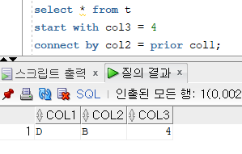

[메인으로 이동](../README.md)

# 📒 SQLD 최종 정리 2편

- 1편에 설명


## 목차 <a id="aid-index">

[📒 1편](./최종정리%201편.md)

### 📒 2편

1. [윈도우 함수](#aid-1)
1. [계층형 질의와 셀프 조인](#aid-2)
1. [절차형 PL/SQL](#aid-3)
1. [데이터모델링](#aid-4)
1. [엔터티](#aid-5)
1. [속성](#aid-6)
1. [도메인](#aid-7)
1. [관계](#aid-8)
1. [식별자](#aid-9)
1. [식별자 관계, 비식별자 관계](#aid-10)
1. [성능 데이터 모델링](#aid-11)
1. [⭐ 정규화](#aid-12)
1. [반정규화](#aid-13)
1. [대량 데이터에 따른 성능](#aid-14)
1. [슈퍼/서브타입](#aid-15)
1. [분산데이터베이스](#aid-16)
1. [⭐ 조인 수행 원리](#aid-17)
1. [옵티마이저](#aid-18)
1. [인덱스](#aid-19)
1. [실행계획](#aid-20)
1. [pivot](#aid-21)
1. [기출 링크](#aid-22)

## 2편

### 🔷 윈도우 함수 <a id="aid-1">

[목차로 이동](#aid-index)

1. rows, range
    - 결과값 상 차이점
        - 같은값 유무 파악 (같은 값 있으면 range)
    - 예시
        - rows: 물리적인 단위로 행 집합을 지정

            

            - 물리적인 행 하나하나 누적하면서 더해간다. 

        - range: 논리적인 단위로 행 집합을 지정

            

            - order by 기준으로 정렬할 때 논리적으로 같은 순서면 같은 값이 나온다.
        
1. rank, dense_rank (기출 40회)
    - rank: 중복 건너뛴다. (1, 1, 3, 4)
    - dense_rank: 건너뛰기x (1, 1, 2, 3)
1. partition by, order by
1. 윈도우 함수는 무조건 문제풀기식으로 공부
1. 참고
    - [PARTITION BY, ROW_NUMBER, RANK, DENSE_RANK](https://gent.tistory.com/442)
    - [row, range 차이점](https://hongsii.github.io/2017/12/12/window-function-range/)

1. 기출
    1. 40회
        - 1, 2, 2, 3, ... 순서로 순위를 도출하는 함수는? DENSE_RANK

### 🔷 계층형 질의와 셀프 조인 <a id="aid-2">

[목차로 이동](#aid-index)

1. 계층형 질의 이론
    1. `prior 자식데이터 = 부모데이터`
        - 순방향으로 전개한다.
            - 부모에서 자식 방향으로 전개하는 방향 (순방향)
                -  START WITH에서 정해진 위치의 자식을 찾고, 또 그 자식의 자식을 찾는 방식
        - `부모데이터 = prior 자식데이터`와 같다.
        - ex) PRIOR 사원번호 = 매니저사원번호

1. 계층형 질의 문제 풀이 전략
    - ID라는 임의의 컬럼을 만들어주고 풀자. 덜 헷갈린다.
    - `CONNECT BY col1 = PRIOR col2`가 있을 때
        1. ⭐ PRIOR 다음에 있는 컬럼(col2)을 현재 보고 있는 개체에 적용한다.
        1. 따라서, 현재 보고있는 개체의 col2 값과 같은
        1. col1의 값을 가진 개체가 다음 레벨의 개체가 된다.

1. ORDER SIBLINGS BY
    - ORDER SIBLINGS BY 예제

        

        - 순방향으로 전개하면서 같은 형제에 대해서는 EMPNO 순으로

1. 셀프 조인 (SELF JOIN)
    - 한 테이블 내 두 컬럼이 연관관계가 있을 때 동일 테이블 사이의 조인
        - FROM 절에 동일 테이블이 2번 이상 나타난다.
    - 반드시 테이블 별칭을 사용해야 한다.
        - `FROM EMP E1, EMP E2` 처럼
    
1. 문제
    1. 계층 쿼리에서 형제 노드 간의 정렬을 지정하는 구문
        - ORDER SIBLINGS BY

    1. 노랭이 94쪽 2과목 87번 (prior 기본)
        - [정미나 풀이](https://youtu.be/boNut__USIU)

    1. 기출 38회 (prior + where)

        - 문제

            

        - 해설강의
            - https://youtu.be/G9xtiEH2LTg
            - 쏭즈캠퍼스
            - 00:00 ~ 17:42 계층형 질의 설명

        - 실습코드

            ```sql
                create table t (
                    col1 varchar2(10),
                    col2 varchar2(10),
                    col3 number(10)
                );

                INSERT into t values ('A', null, 1);
                INSERT into t values ('B', 'A', 2);
                INSERT into t values ('C', 'A', 3);
                INSERT into t values ('D', 'B', 4);

                SELECT count(*) from t where col3 <> 2
                start with col3 = 4
                connect by col1 = prior col2;        
            ```

        - 풀이
            - WHERE 조건은 트리 다 만들고 나서 조건 안맞는 애만 뺀다.
        
        - 참고 (where 조건 뺀 SELECT * 결과)
            - 역방향 (col3=4)

                

                - level 까지 조회

                    

            - 순방향 (col3=4)

                
            
            - col3=2 일 때 순방향, 역방향

                

                

            - col3=1 일 때 순방향, 역방향

                <!--  -->

                

                

    1. 34회 기출 어렵게 나온 문제 있다고 한다.
            

### 🔷 절차형 PL/SQL <a id="aid-3">

[목차로 이동](#aid-index)

1. PL/SQL 구조
    1. DECLARE
        - 선언부(변수, 상수)
    1. BEGIN ~ END
        - 실행부
    1. EXCEPTION
        - 예외 처리부 (BEGIN ~ END 사이 위치)
        - 선택 항목

1. PL/SQL 특징
    - Block 구조로 되어있어 각 기능별로 모듈화 가능
    - 변수, 상수 등을 선언하여 SQL 문장 간 값 교환
    - IF, LOOP 등의 절차형 언어를 사용하여 절차적 프로그램 가능
    - DBMS 정의 에러나 사용자 정의 에러 정의하여 사용 가능
    - PL/SQL은 Oracle에 내장되어 있으므로 호환성 좋음
    - 응용 프로그램의 성능 향상
    - Block 단위로 처리하여 통신량을 줄일 수 있다.

1. procedure, trigger, user defined function 차이점
    - procedure
        - BEGIN ~ END 절 내에 COMMIT, ROLLBACK 사용 가능
        - EXECUTE 명령어로 실행한다.
    - trigger
        - COMMIT, ROLLBACK 사용 불가능
        - 생성 후 자동으로 실행된다.
    - user defined function
        - 반드시 리턴 값이 존재해야 한다.

### 🔷 데이터모델링 <a id="aid-4">

[목차로 이동](#aid-index)

1. 데이터모델링 유의점
    - 중복: 데이터베이스가 여러 장소에 같은 정보를 저장하지 않게 한다
    - 비유연성: 데이터정의를 데이터 사용프로세스와 분리
    - 비일관성: ex)신용상태에 대한 갱신 없이 고객의 납부이력정보 갱신

1. 모델링의 3가지 관점 (기출 42회)
    - 데이터 관점(What)
        - 업무가 어떤 데이터와 관련이 있는지 또는 데이터 간의 관계는 무엇인지에 대해서 모델링하는 방법
    - 프로세스 관점(How)
        - 업무가 실제하고 있는 일은 무엇인지 또는 무엇을 해야 하는지를 모델링하는 방법
    - 데이터와 프로세스의 상관관점
        - 업무가 처리하는 일의 방법에 따라 데이터는 어떻게 영향을 받고 있는지 모델링하는 방법


1. 참고 사이트
    - [데이터 모델링(https://doorbw.tistory.com/229)](https://doorbw.tistory.com/229)

1. 문제
    - 기출 42회
        - 설명보고 어떤 관점인지 고르는 문제 (답: 데이터와 프로세스의 상관관점)

### 🔷 엔터티 <a id="aid-5">

[목차로 이동](#aid-index)

1. 엔터티 도출 방법 (관리하고자하는 대상)
2. 엔터티 특징 (기출 41회)
    - 업무에서 필요로 하는 정보
    - 식별자에 의해 식별이 가능 해야 한다.
    - 인스턴스의 집합
    - 업무프로세스에 의해 이용
    - 속성을 포함
    - 관계의 존재
3. 분류 (기출 42회)
    
    1. 유무형에 따른 분류
        - 유형 엔터티: 물리적인 형태가 있고, 안정적이며 지속적으로 활용되는 엔터티
            - ex) 사원, 물품, 강사
        - 개념 엔터티: 물리적인 형태는 존재하지 않고 개념적 정보로 구분되는 엔터티
            - ex) 조직, 장소, 보험상품
        - 사건 엔터티: 업무를 수행함에 따라 발생되는 엔터티로 비교적 발생량이 많으며 각종 통계에 이용될 수 있음
            - ex) 주문, 창구, 미납
    1. 발생시점에 따른 엔터티 
        - 기본
            - ex) 사원, 조직, 상품, 부서, 고객, 자제
            - 업무에 원래 존재하는 정보. 엔터티와의 관계에 의해 생성되지 않고 독립적으로 생성 가능
            - 타 엔터티의 부모 역할. 다른 엔터티로부터 주식별자를 상속받지 않고 자신의 고유한 주식별자를 갖는다.
            
        - 중심 
            - ex) 매출, 계약, 주문, 접수, 사고, 예금원장, 청구
            - 기본엔터티로부터 발생. 업무에서 중심적인 역할을 한다.
            - 데이터의 양이 많이 발생되고 다른 엔터티와의 관계를 통해 많은 행위 엔터티를 생성한다.
        
        - 행위
            - ex)주문내역, 계약진행, 사원변경이력
            - 두 개 이상의 부모엔터티로부터 발생되고 자주 내용이 바뀌거나 데이터량이 증가된다.
            - 분석초기 단계에서는 잘 나타나지 않으며 상세 설계단계나 프로세스와 상관모델링을 진행하면서 도출될 수 있다.

1. 엔티터 예시
    - 교수, 학생, 수강
    - 엔터티의 종류가 아닌 것: 청약자

1. 문제
    1. 기출42회
        - 선지마다 어떤 엔터티의 특징을 보여주고 유무형에 따른 분류 엔터티인지 발생시점 분류 엔터티인지 구분하기
            - ex) 물리적인 형태로 구분되는 엔터티: 유무형에 따른 분류 엔터티

### 🔷 속성 <a id="aid-6">

[목차로 이동](#aid-index)

1. 속성의 개념 (기출 42회)
    - 업무에서 필요로 하는 인스턴스로 관리하고자 하는 의미상 더이상 분리되지 않는 최소의 데이터 단위
    - 업무에서 필요로 한다.
    - 의미상 더 이상 분리되지 않는다.
    - 엔터티를 설명하고 인스턴스의 구성요소가 된다. (기출 42회)

1. 엔터티, 인스턴스, 속성, 속성값의 관계
    - 한 개의 엔터티는 두 개 이상의 인스턴스의 집합이어야 한다.
    - 한 개의 엔터티는 두 개 이상의 속성을 갖는다.
    - 한 개의 속성은 한 개의 속성값을 갖는다.

1. 분류

    - 기본 속성, 설계 속성, 파생 속성 정의와 예시 (기출 42회, 41회)
        - 기본 속성: 업무로부터 추출한 모든 일반적인 속성
            - ex) 제품이름, 제조년월, 제조원가
        - 설계 속성: 업무를 규칙화하기 위해 새로 만들거나 변형, 정의하는 속성
            - ex) 일련번호, 약품용기코드
        - 파생 속성: 다른 속성에 영향을 받아 발생하는 속성. 빠른 성능을 낼 수 있도록 원래 속성의 값을 계산. 적을수록 좋다.
            - ex) 합, 계산값

1. 기출
    1. 42회 (속성의 개념)
        - 속성의 개념에 대한 문제 (답: 엔터티를 설명하고 인스턴스의 구성요소가 된다.)
    
    1. 42회 (파생 속성)
        - 파생 속성 찾기 (정답: 총금액)
    

### 🔷 도메인 <a id="aid-7">

[목차로 이동](#aid-index)

1. 데이터 유형, 크기, 제약 조건
2. check, primary key, ...

### 🔷 관계 <a id="aid-8">

[목차로 이동](#aid-index)

1. 관계
    - 관계는 엔터티 간의 관련성을 의미하며 존재관계와 행위관계로 구분
    - 관계의 종류
        - 존재관계
            - 존재 여부의 관계 (엔터티 간의 상태 의미)
            - ex) 고객이 은행 회원가입을 하면 관리점이 할당되는 것
        - 행위관계
            - 어떤 행위에 의한 관련성의 관계
            - ex) 증권회사는 계좌를 개설하고 주문을 발주

1. 관계의 표기법에 표현되는 개념 3가지
    - 관계명, 관계차수, 관계선택사양

1. 관계 차수 (기출 42회)
    - 두 개의 엔터티 간 관계에 참여하는 수
    - 관계 차수의 종류
        - 1대1 관계
            - 완전 1대1
                - 하나의 엔터티에 관계되는 엔터티의 관계가 하나 있는 경우. 반드시 존재
            - 선택적 1대1
                - 하나의 엔터티에 관계되는 엔터티의 관계가 하나이거나 없을 수도 있다.
        - 1대N 관계
        - M대N 관계
    - 필수적 관계와 선택적 관계
        - 필수적 관계
            - 반드시 하나가 있어야 하는 관계
            - '|'로 표현
        - 선택적 관계
            - 없을 수도 있는 관계. 예) 고객은 있지만 계좌는 없다.
            - 'O'로 표현
    

1. IE표기법과 Barker표기법 
    
    

    - 참고
        - IE 표기법
            - https://itpenote.tistory.com/598?category=898785
        - Barker 표기법
            - https://itpenote.tistory.com/597
      
1. 문제
    1. 기출 42회
        - 관계차수 관련 문제

### 🔷 식별자 <a id="aid-9">

[목차로 이동](#aid-index)

1. 식별자 개념
    - 엔터티 내에서 인스턴스를 구분하는 구분자
    - 식별자는 논리적 데이터 모델링 단계에서 사용
        - Key는 물리적 데이터 모델링 단계에서 사용

1. 주식별자 특징
    - 4가지: 유일성, 최소성, 불변성, 존재성
    - 유일성: 주식별자에 의해 모든 인스턴스들이 유일하게 구분
    - 최소성: 주식별자를 구성하는 속성의 수는 유일성을 만족하는 최소의 수가 되어야 함.
    - 불변성: 지정된 주식별자의 값은 자주 변하지 않아야 함. 변하면 이전 기록 말소됨.
    - 존재성: 주식별자가 지정되면 반드시 값이 들어와야 함

1. 식별자 분류
    - 엔터티 내에서 대표성을 가지는지 여부: 주식별자, 보조식별자
    - 엔터티 내에서 스스로 생성되었는지 여부: 내부식별자, 외부식별자
    - 단일 속성으로 식별 되는지 여부: 단일식별자, 복합식별자
    - 업무적으로 만들어지지 않고 인위적으로 만들어졌는지 여부(대체 여부): 본질식별자(원조식별자), 인조식별자(대리 식별자)

1. 표기법에서 식별자 구분 (기출 42회)

    

    

1. 주식별자 도출기준
    - 해당 업무에서 자주 이용되는 속성
    - 명칭, 내역 등과 같이 이름으로 기술되는 것은 X
    - 복합으로 주식별자 구성할 때 너무 많은 속성 X
        - 너무 많으면 인조식별자 생성

1. 기출
    1. 42회
        식별자 고르는 문제 (정답: 주식별자, 보조식별자, 외부식별자)  

### 🔷 식별자 관계, 비식별자 관계 <a id="aid-10">

[목차로 이동](#aid-index)

1. 식별, 비식별 특징
    1. 식별
        - 강한 관계
        - SQL 구문 복잡해진다.
            - 조인 조건 늘어난다. (조인 수가 늘어나는 것은 절대 아니다. 그건 비식별)
        - PK 속성수 늘어난다.
    1. 비식별
        - 약한 관계
        - 조인 수가 늘어나 느려진다.
    
1. 기술 (IE vs Baker)
    
    
    
1. ERD 서술 규칙
    1. 시선 좌상 → 우하
    2. 관계명 반드시 표기 안해도 된다.
    3. UML → 객체지향에서만 쓰인다.

1. 문제
    1. 기출 42회
        - 비식별자관계와 조인 관련 문제
            - 비식별자관계는 조인이 많아진다.

### 🔷 성능 데이터 모델링 <a id="aid-11">

[목차로 이동](#aid-index)

1. 모델링 종류
    1. 아키텍처
        - 테이블, 파티션
        - 정규화, 반정규화
    2. SQL 명령문
        - 조인 수행 원리
        - optimizer
        - 실행계획

### 🔷 ⭐ 정규화 <a id="aid-12">

[목차로 이동](#aid-index)

1. 정규화 방법
    1. 1차 정규화: 원자성
    1. 2차 정규화: 부분함수종속제거
    1. 3차 정규화: 이행함수종속제거
        - 엔티티의 일반속성 간에 서로 종속되지 않도록 한다.

1. 이상현상 정의와 예시

1. 성능
    - SELECT는 성능 느려질수 있다. (join 때문에)
    - INSERT, UPDATE는 빨라질 수 있다. (테이블 작아져서)
1. 정규화 많이 보기

1. 문제
    1. 기출 42회
        - 3차 정규형 문제: 일반 속성 간 종속성 제거

### 🔷 반정규화 <a id="aid-13">

[목차로 이동](#aid-index)

1. 데이터 무결성 해친다.
2. 반정규화 고려 순서
    1. 빈도수 조사 (대량범위, 범위처리, 통계처리)
    2. 응용시스템변경, 클러스터링/인덱스, 뷰 고려
    3. 위 방법으로 해결 안될 시 반정규화 고려
3. 반정규화 방법 및 기법
    1. 테이블 반정규화: 병합(1:1, 1:M, 슈퍼/서브), 분할(부분T, 통계T, 중복T)
    2. 컬럼(속성) 반정규화(파생, 오류, 이력컬럼, PK →속성, 중복속성)
        - 중복컬럼 추가: 조인 감소를 위해
        - 파생컬럼 추가: 미리 값 계산해서 컬럼에 저장
        - 이력테이블컬럼 추가: 최근값 여부, 시작종료일자
        - PK에 의한 컬럼 추가: 단일 속성으로 구성된 복합 속성 PK를 분리
        - 응용시스템 오작동 위한 컬럼 추가: backup 컬럼 추가
    3. 관계 반정규화(중복관계추가)

### 🔷 대량 데이터에 따른 성능 <a id="aid-14">

[목차로 이동](#aid-index)

1. row migration, row chaining
    - 정의 읽어만 보기
2. 파티셔닝 (list, range, hash) 특징
    - range: 관리 쉽다, 가장많이 쓰인다
    - hash: 관리가 어렵다

### 🔷 슈퍼/서브타입 <a id="aid-15">

[목차로 이동](#aid-index)

1. 슈퍼타입/서브타입 특징
    - [참고사이트(https://velog.io/@mindddi/)](https://velog.io/@mindddi/DB%EB%AA%A8%EB%8D%B8%EB%A7%81-%EA%B4%80%EA%B3%84%EC%8A%88%ED%8D%BC-%EC%84%9C%EB%B8%8C%ED%83%80%EC%9E%85)

1. 슈퍼타입 / 서브타입 모델의 성능고려 방법

1. 슈퍼/서브타입 데이터 모델 변환

    

    1. 용량
        1. 적은경우: one to one. 트랜잭션이 개별로
        2. 큰경우: 트랜잭션 유형으로

    1. 트랜잭션
        1. 공통/차이. plus type
        2. 전체 통합. single type

    1. 참고

        - [데이터베이스 구조와 성능(https://eehoeskrap.tistory.com/57)](https://eehoeskrap.tistory.com/57)


### 🔷 분산데이터베이스 <a id="aid-16">

[목차로 이동](#aid-index)

1. 투명성 개념
    - 요즘 잘 안나온다.
2. 데이터 무결성 해친다.

### 🔷 ⭐ 조인 수행 원리 <a id="aid-17">

[목차로 이동](#aid-index)

1. 문제 많이 풀기

1. 개념
    - Oracle의 실행계획에 나타나는 기본적인 Join 기법으로는 NL Join, Hash Join, Sort Merge Join이 있다.

1. 종류
    1. NL 조인(Nested Loop Join)
        - 중첩 반복문과 같은 방식으로 조인 수행
        - 랜덤 액세스 방식으로 데이터를 읽는다.
            - 랜덤 액세스 방식의 예로 인덱스 스캔(Index Scan)이 있다.
        - OLTP 목록 처리 업무에 많이 사용된다.
        - 조인 컬럼에 적당한 인덱스가 있어서 자연조인(Natural join)이 효율적일 때 유용하다.
        - Driving Table의 조인 데이터 양이 큰 영향을 주는 조인 방식이다.
            - Driving Table: JOIN시 먼저 액세스 되어서 ACCESS PATH를 주도하는 테이블
        - 유니크 인덱스를 활용하여 수행시간이 적게 걸리는 소량 테이블을 온라인 조회하는 경우 유용하다.

    1. 소트 머지 조인(Sort Merge Join)
        - 조인 컬럼 기준으로 데이터를 정렬하여 조인한다.
        - 동등, 비동등 조인 가능하다.
        - 스캔 방식 (넓은 데이터 범위)으로 데이터를 읽는다.
        - NL Join(랜덤 액세스)에서 부담이 되던 넓은 범위의 데이터를 처리할 때 이용되던 조인 기법이다.
        - Sort Merge Join은 정렬할 데이터가 많아 메모리에서 모든 정렬 작업을 수행하기 어려운 경우에는 임시 영역(디스크)을 사용하기 때문에 성능이 떨어질 수 있다.
        - DW 등의 데이터 집계 업무에서 많이 사용된다. (Hash Join도)
    
    1. 해시 조인(Hash Join)
        - 조인을 수행할 테이블의 조인 컬럼을 기준으로 해쉬 함수를 수행하여 서로 동일한 해쉬 값을 갖는 것들 사이에서 실제 값이 같은지를 비교하면서 조인을 수행한다.
        - Hash Join은 NL Join의 랜덤 액세스 문제점과 Sort Merge Join의 문제점인 정렬 작업의 부담을 해결 위한 대안으로 등장하였다.
        - DW 등의 데이터 집계 업무에서 많이 사용된다. (Sort Merge Join도)
        - 소트 머지 조인을 수행하기에 두 테이블이 너무 커서 소트(Sort) 부하가 심할 때는 Hash Join이 유용하다.
        - '='로 수행하는 동등 조인에서만 사용할 수 있다.
        - 결과 행의 수가 적은 테이블을 선행 테이블로 사용하는 것이 좋다.

1. 문제 풀이 팁
- EXISTS가 있는 문장에서
    - 인덱스가 있으면 NESTED LOOP SEMI JOIN
    - 인덱스가 없으면 HASH SEMI JOIN 

### 🔷 옵티마이저 <a id="aid-18">

[목차로 이동](#aid-index)

1. CBO, RBO 정의 정도만 공부하기
    1. CBO: 경로
    2. RBO: 규칙
2. 요즘 잘 안나온다.

1.CBO, RBO 특징
    - CBO (비용 기반 옵티마이저)
        - 테이블, 인덱스, 컬럼 등 객체의 통계정보를 사용하여 실행계획을 수립하므로 통계정보가 변경되면 SQL의 실행계획이 달라질 수 있다.
        - 

    - RBO (규칙 기반 옵티마이저)
        - 가장 우선 순위가 높은 규칙: Single row by rowid

### 🔷 인덱스 <a id="aid-19">

[목차로 이동](#aid-index)

1. 인덱스 언제 사용
    1. 부정형, LIKE, 묵시적형변환일 때 안쓴다.
2. 인덱스 사용 시 다음 성능 저하
    1. INSERT, UPDATE, DELETE

### 🔷 실행계획 <a id="aid-20">

[목차로 이동](#aid-index)

1. ⭐ 실행 순서 딱 하나만 보기
    
    

### 🔷 pivot <a id="aid-21">

[목차로 이동](#aid-index)

1. 빈칸에 pivot / unpivot 중 고를 수 있을정도로만 보기


### 🔷 기출 링크 <a id="aid-22">

[목차로 이동](#aid-index)

1. SQLD 42회
    - [SQLD 42회 복원 1단원 10문제, 2단원 일부 (sqlpd 카페)](https://cafe.naver.com/sqlpd/24150)
    - [SQLD 42회 복원 - 2단원 (sqlpd 카페)](https://cafe.naver.com/sqlpd/24249)

1. SQLD 41회
    - [SQLD 41회 기출 복원 (구글 엑셀 시트)](https://docs.google.com/spreadsheets/d/1wBFjFBDlamp8Lw7botCanEZxSBwUMxMXeXZD1O7pjvY/edit#gid=0)

1. SQLD 40회
    - [SQLD 40회 기출 문제, 답 (https://yurimac.tistory.com/38)](https://yurimac.tistory.com/38)

1. SQLD 39회
    - [임베스트 - SQLD 39회 기출 풀이 영상(1)](https://youtu.be/SENIt9GFMV8)
    - [임베스트 - SQLD 39회 기출 풀이 영상(2)](https://youtu.be/9Kgmxr3PCsY)

1. SQLD 38회
    - [쏭즈캠퍼스 - SQLD 38회 기출 풀이 영상(1)](https://youtu.be/G9xtiEH2LTg)
    - [쏭즈캠퍼스 - SQLD 38회 기출 풀이 영상(2) ~ (6)](https://www.youtube.com/playlist?list=PLJyu27XFq6X0Sa2622T9pan9WEQaUFFKg)

1. SQLD 이전 기출
    - [SQLD 21, 24, 25, 26, 30, 34회 기출 pdf]

1. 기타
    - [정미나 - SQLD 스피드퀴즈 영상(1)](https://youtu.be/rWdfFV8Wb18)
    - [정미나 - SQLD 스피드퀴즈 영상(2)](https://youtu.be/tLrm4U-a8Hk)
    - [정미나 - SQLD 노랭이 문제 풀이 목록](https://www.youtube.com/playlist?list=PLyQR2NzLKOCZU_jjLAdebyx9oE9dvvsrE)
        - P44/9, P50/21, P55/34, P58/39, P60/41, P68/53, P78/66, P94/87, P95/89, P96/91, P98/93
        - P101/97, P103/100, P104/101, P108/105, P115/111, P116/113

[목차로 이동](#aid-index)

[메인으로 이동](../README.md)

